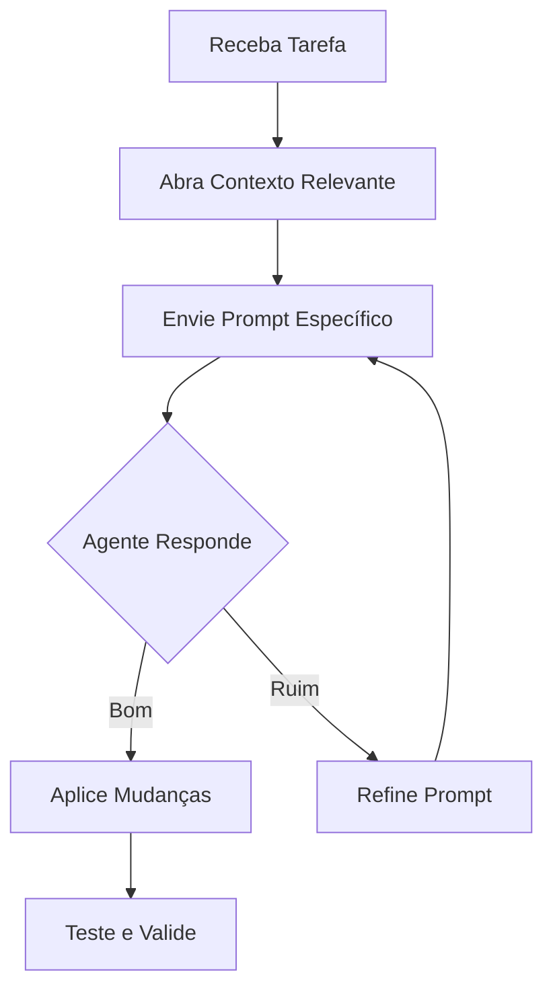

# Workflow Avançado

Para usuários experientes: processos avançados com agentes Copilot.

## Integração com CI/CD

1. **Gere Scripts**: Peça ao agente para criar GitHub Actions
2. **Valide Pipelines**: Use skills para revisar YAML
3. **Automatize Testes**: Agente sugere testes para novos códigos

## Multi-linguagem

- **Projeto Híbrido**: Defina instructions separadas por pasta
- **Context Switching**: Abra arquivos relevantes por linguagem
- **Skills Compartilhadas**: Reutilize patterns entre tecnologias

## Otimização de Performance

- **Prompt Engineering**: Seja específico para reduzir latência
- **Cache de Contexto**: Mantenha arquivos abertos
- **Batch Tasks**: Agrupe tarefas similares

## Colaboração em Equipe

- **Padronização**: Compartilhe instructions via repositório
- **Code Reviews**: Agente auxilia na revisão
- **Documentação**: Gera docs automaticamente

## Diagramas de Processo

Para workflows básicos, veja [Workflow](../workflow.md).