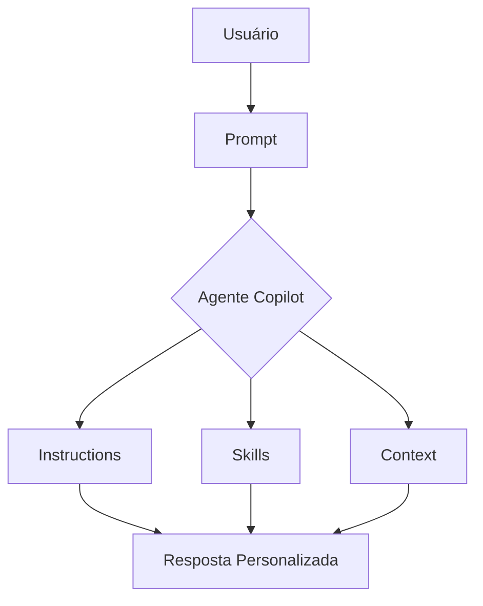

# Guia do Agente Copilot

## Visão Geral

O GitHub Copilot é uma ferramenta poderosa projetada para auxiliar desenvolvedores em tarefas variadas, aproveitando inteligência artificial. Este guia fornece uma visão abrangente de seus recursos, capacidades e casos de uso, com foco em agentes personalizados.

## Recursos

- **Processamento de Linguagem Natural**: O Copilot pode entender e responder a consultas do usuário em linguagem natural, tornando as interações intuitivas e amigáveis.
- **Automação de Tarefas**: Automatize tarefas repetitivas para economizar tempo e aumentar a produtividade.
- **Aprendizado e Adaptação**: O Copilot aprende com interações do usuário, melhorando suas respostas e capacidades ao longo do tempo.

## Capacidades

1. **Recuperação de Informações**: Busque rapidamente informações de várias fontes com base nas solicitações do usuário.
2. **Análise de Dados**: Analise conjuntos de dados e forneça insights ou recomendações.
3. **Integração com Ferramentas**: Integre-se perfeitamente com outras aplicações e serviços para aprimorar a funcionalidade.

## Casos de Uso

- **Suporte ao Desenvolvedor**: Use o Copilot para auxiliar em consultas de desenvolvimento e fornecer suporte instantâneo.
- **Assistente Pessoal**: Automatize agendamento, lembretes e outras tarefas pessoais.
- **Geração de Conteúdo**: Auxilie na geração de conteúdo para blogs, relatórios e outros documentos.

## Templates de Agentes

Para exemplos práticos de agentes especializados, consulte os templates disponíveis no repositório:

- [Java Spring Boot](../templates/java-spring/agent-instructions.md): Agente focado em desenvolvimento com Spring Boot 3.
- [JavaScript Node](../templates/javascript-node/agent-instructions.md): Agente para Node.js com ESM e validação Zod.
- [Python FastAPI](../templates/python-fastapi/agent-instructions.md): Agente para APIs modernas com FastAPI.
- [Angular](../templates/angular/agent-instructions.md): Agente para refatoração de componentes Angular.

Estes templates demonstram como configurar agentes personalizados para tecnologias específicas, seguindo melhores práticas.

## Primeiros Passos

Para começar a usar o Copilot, siga as instruções no guia [Primeiros Passos](../docs/getting-started.md). Certifique-se de ter as configurações necessárias em vigor.

## Conclusão

O Copilot é uma ferramenta versátil que pode melhorar significativamente a produtividade e eficiência. Explore seus recursos e capacidades para aproveitar ao máximo sua experiência. Para mais assistência, consulte o [FAQ](faq.md) ou [Instruções](../docs/instructions.md).