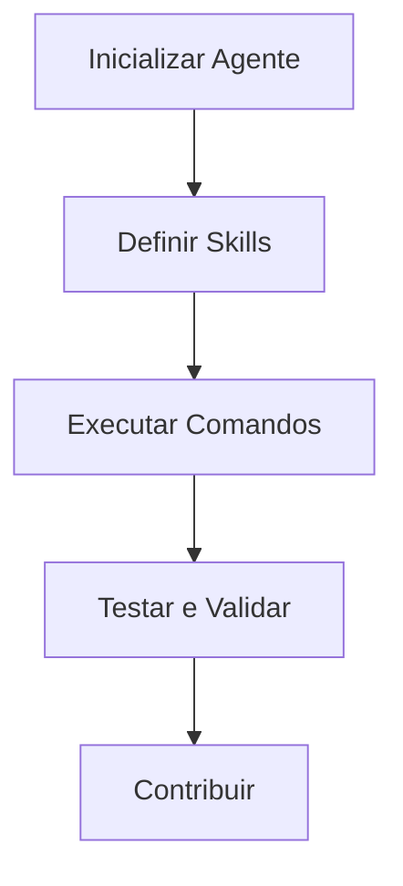

# Workflow para Usar os Agentes do Copilot

Este documento descreve o workflow para utilizar efetivamente os agentes do Copilot neste repositório. Siga os passos abaixo para garantir uma experiência suave.

## 1. Configuração

Antes de começar a usar os agentes do Copilot, certifique-se de ter completado a configuração conforme descrito no guia [Primeiros Passos](../docs/getting-started.md). Isso inclui instalar dependências necessárias e configurar seu ambiente.

## 2. Entendendo o Workflow

O workflow para usar os agentes do Copilot pode ser dividido nos seguintes passos:

### Passo 1: Inicializar o Agente Copilot

- Configure o Copilot em seu projeto.
- Ajuste parâmetros ou configurações necessárias.

### Passo 2: Definir Skills

- Utilize a documentação [Skills](../docs/skills.md) para entender as várias skills disponíveis.
- Crie ou modifique skills conforme necessário usando o [template de skill](../docs/templates/skill-template.md).

### Passo 3: Executar Comandos

- Use as skills definidas para executar comandos através do Copilot.
- Consulte as [Instruções](../docs/instructions.md) para uso detalhado de comandos e melhores práticas.

### Passo 4: Teste e Validação

- Certifique-se de que sua implementação funcione conforme esperado executando testes.
- Siga as diretrizes de teste fornecidas no documento [Contribuição](../docs/contributing.md).

## 3. Solução de Problemas

Se encontrar problemas durante o workflow, consulte o [FAQ](faq.md) para problemas comuns e soluções. Você também pode contatar a comunidade para suporte.

## 4. Contribuindo para o Workflow

Se tiver sugestões para melhorar este workflow ou passos adicionais que devem ser incluídos, consulte o guia [Contribuição](../docs/contributing.md) para instruções sobre como enviar seu feedback.

Seguindo este workflow, você poderá utilizar efetivamente os agentes do Copilot e contribuir para seu desenvolvimento contínuo.